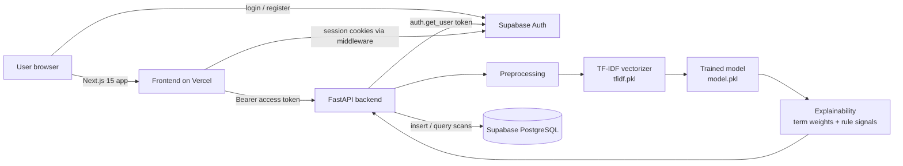
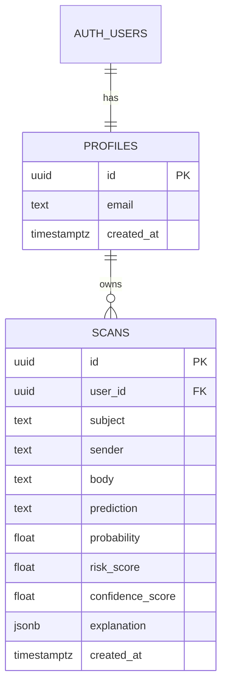

# ThreatGuard

AI-powered email phishing detection. Users register, paste an email (subject, sender, body), and get a verdict, risk score, confidence, probability and a plain-language explanation. Every scan is stored in Supabase and feeds an analytics dashboard.

- **Frontend:** Next.js 15, TypeScript, Tailwind CSS, shadcn-style UI components, Recharts
- **Backend:** FastAPI (Python)
- **ML:** TF-IDF + Logistic Regression / Random Forest / XGBoost, best model selected automatically
- **Data and auth:** Supabase PostgreSQL + Supabase Auth

## Architecture



Request flow for `POST /api/analyze`:
input -> preprocessing (subject + body) -> TF-IDF -> model -> probability -> confidence -> explanation -> store scan -> return result.

## ER diagram



`scans` has two columns beyond the required schema: `probability` (raw phishing probability) and `explanation` (JSON stored so the results page can be reopened from history).

## Project structure

```
threatguard/
  supabase/schema.sql
  backend/
    app/{api,services,schemas,core}/
    ml/{preprocessing,training,inference,explainability}/
    datasets/            # put your dataset here; generate_sample.py makes a smoke-test file
    models/              # model.pkl, tfidf.pkl written here by train.py
    train.py
    requirements.txt
  frontend/
    app/ components/ hooks/ services/ types/ lib/
```

## Setup

### 1. Supabase

1. Create a project at supabase.com.
2. SQL Editor -> paste and run `supabase/schema.sql`.
3. Authentication -> Providers -> Email. For local testing you can turn off "Confirm email"; otherwise add `http://localhost:3000/auth/callback` (and your production URL) under Authentication -> URL Configuration -> Redirect URLs.
4. Settings -> API: copy the project URL, the `anon` key and the `service_role` key.

### 2. Train the model

Your dataset needs either `subject, sender, body, label` or `email_text, label`. Labels: `0` legitimate, `1` phishing. Common names (`text`, `from`, `spam`/`ham`, `phishing`/`safe`) are mapped automatically.

```bash
cd backend
python -m venv .venv && source .venv/bin/activate     # Windows: .venv\Scripts\activate
pip install -r requirements.txt

python train.py --data datasets/your_dataset.csv
```

Useful flags: `--models logistic_regression random_forest xgboost`, `--test-size 0.2`, `--max-features 30000`, `--min-df 2`, `--seed 42`.

Outputs:

- `models/model.pkl` and `models/tfidf.pkl` (best model by F1, ties broken by ROC-AUC)
- `models/term_direction.pkl` and `models/metadata.json` (used for explanations and the `/health` endpoint)
- `models/reports/confusion_matrix_<model>.png`, `classification_report_<model>.txt`, `model_comparison.json`

To smoke-test the pipeline without a real dataset: `python datasets/generate_sample.py` then train on `datasets/sample_dataset.csv`. That data is synthetic and tiny; its metrics mean nothing. Train on a real corpus before relying on predictions.

### 3. Run the backend

```bash
cd backend
cp .env.example .env      # fill in SUPABASE_URL and SUPABASE_SERVICE_ROLE_KEY
uvicorn app.main:app --reload --port 8000
```

Check `http://localhost:8000/health`. It should report `"status": "ok"` and the model name. The service role key is secret and must never reach the frontend.

### 4. Run the frontend

```bash
cd frontend
cp .env.example .env.local   # Supabase URL, anon key, NEXT_PUBLIC_API_URL=http://localhost:8000
npm install
npm run dev
```

Open `http://localhost:3000`, register, and analyze an email.

## API

All endpoints require `Authorization: Bearer <Supabase access token>`.

| Method | Path | Description |
| --- | --- | --- |
| POST | `/api/analyze` | Body `{subject, sender, body}`. Returns the stored scan with prediction, risk score, confidence, probability, explanation. |
| GET | `/api/history` | Query: `page`, `page_size`, `search`, `prediction` (`phishing`/`safe`), `sort`. |
| GET | `/api/history/{id}` | One scan with its full explanation. |
| GET | `/api/dashboard` | Metrics and chart series (weekly trend, daily activity, risk distribution, phishing vs safe). |
| GET | `/health` | Model status (no auth). |

Scores: `risk_score` = phishing probability x 100. `confidence_score` = confidence in the predicted class x 100. Risk levels: low < 30, medium < 60, high < 80, critical >= 80.

## Explainability

Each result combines two sources:

1. **Model terms:** the vocabulary terms that moved this prediction most (coefficient x TF-IDF for Logistic Regression; feature importance x TF-IDF, signed by class lean, for tree models).
2. **Rule signals:** suspicious sender (look-alike or brand-mismatched domains, high-abuse TLDs, free-mail impersonation), urgency language, credential-harvesting phrases, financial requests, threatening language and suspicious links (raw IPs, shorteners, punycode, `@` tricks, plain http, brand impersonation).

The verdict comes from the model alone. Rule signals explain it and do not change the score.

## Deployment

**Frontend (Vercel):** import the repo, set the root directory to `frontend`, and add `NEXT_PUBLIC_SUPABASE_URL`, `NEXT_PUBLIC_SUPABASE_ANON_KEY`, `NEXT_PUBLIC_API_URL`. Add the Vercel URL to Supabase redirect URLs.

**Backend:** `backend/vercel.json` and `backend/api/index.py` are included for a Vercel Python deployment (root directory `backend`; commit your trained `models/*.pkl`). Vercel limits serverless bundles to 250 MB unzipped, and scikit-learn plus XGBoost together may exceed that. If the deploy fails on size, either train with `--models logistic_regression random_forest` and remove `xgboost` from `requirements.txt`, or host the API on any Python host using the included `Procfile` (Render, Railway, Fly). Set `SUPABASE_URL`, `SUPABASE_SERVICE_ROLE_KEY` and `CORS_ORIGINS` (your frontend URL) on whichever host you use.

## Security notes

- Tokens are verified server-side with Supabase on every request; every query is filtered by the authenticated user's id, and RLS is enabled on both tables.
- Inputs are length-limited and validated; the sender must contain a valid email address.
- CORS is restricted to `CORS_ORIGINS`.
